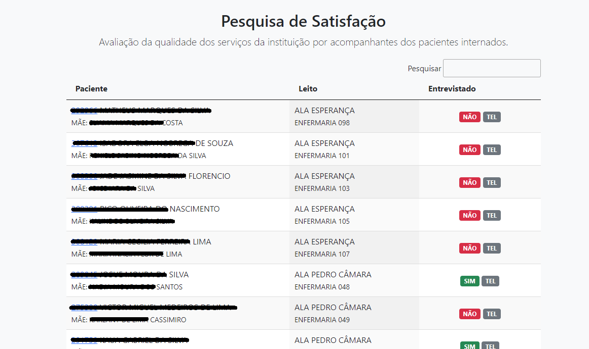
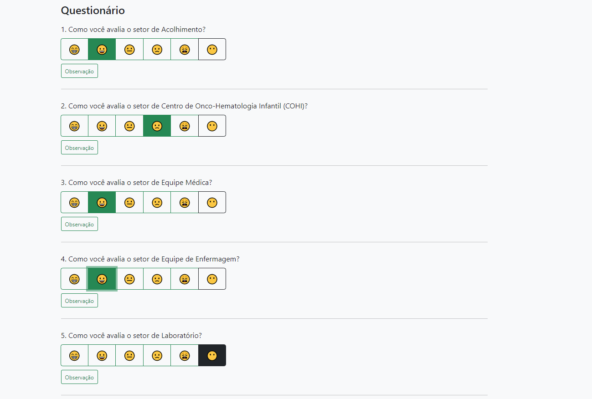
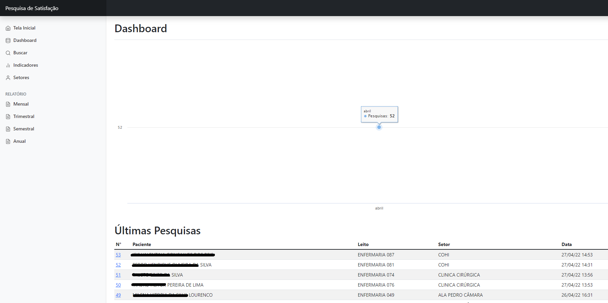
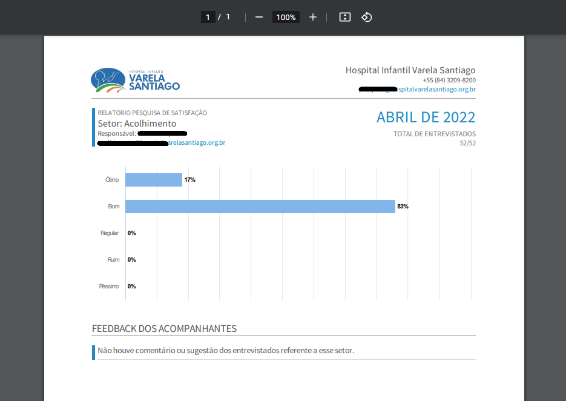

# pesquisa-satisfacao
 Sistema para realizar a pesquisa de satisfação no hospital, eliminando papel e acessando diretamente via celular no leito do paciente.

Esse sistema tem como objetivo otimizar o processo de pesquisa de satisfação dos pacientes internados no hospital, realizando a pesquisa diretamente no leito do paciente e eliminando o uso de papel.

O sistema utiliza PHP, JavaScript e T-SQL, conectado ao banco de dados local do sistema Smart da [PIXEON](https://www.pixeon.com/).

### Gerar PDF
 Para gerar os relatório em formato PDF, utilizei o projeto [PHP WkHtmlToPdf](https://github.com/mikehaertl/phpwkhtmltopdf) de [Michael Härtl](https://github.com/mikehaertl).

### Telas

### Configuração

É necessário alterar o arquivo `config/config.php` com as configurações de acesso ao seu banco SQL Server e MySQL.

## Opções de respostas

 - 😁 - Ótimo
 - 😀 - Bom
 - 😐 - Regular
 - 🙁 - Ruim
 - 😩 - Péssimo
 - 😶 - Não utilizado